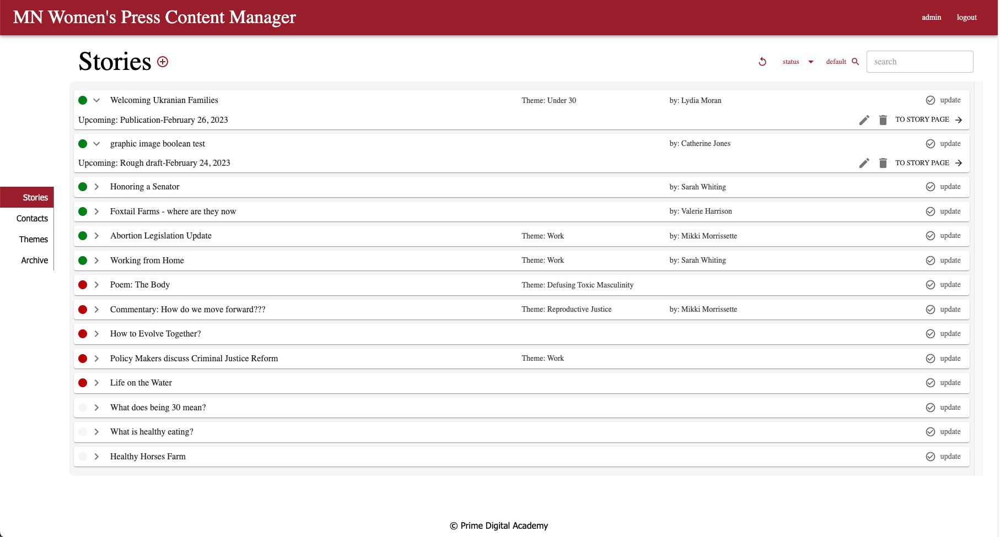
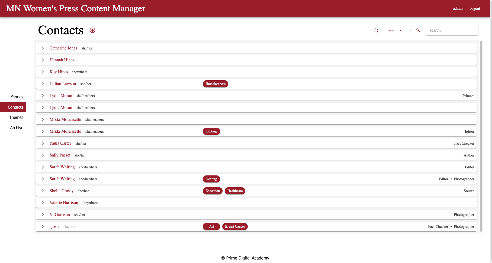
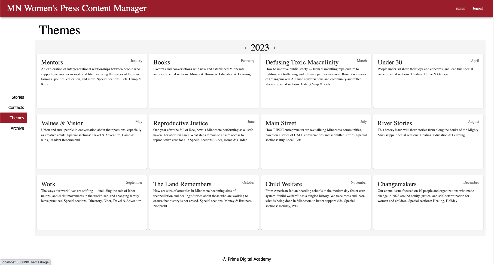
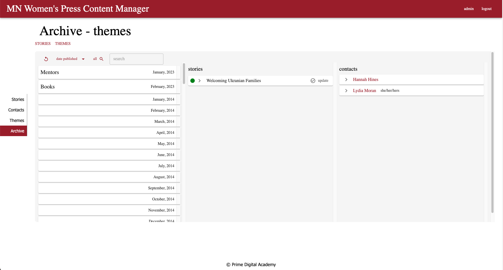

# Minnesota Women's Press Content Manager
This version uses React, Redux, Express, Passport, and PostgreSQL (a full list of dependencies can be found in `package.json`).

We **STRONGLY** recommend following these instructions carefully. It's a lot, and will take some time to set up, but your life will be much easier this way in the long run.

## Prerequisites

Before you get started, make sure you have the following software installed on your computer:

- [Node.js](https://nodejs.org/en/)
- [PostgreSQL](https://www.postgresql.org/)
- [Nodemon](https://nodemon.io/)

## Create database and table

Create a new database called `mn_women_press_app` and create all table sing reference below:

[SQL tables and preview data](/database.sql)

If you would like to name your database something else, you will need to change `mn_women_press_app` to the name of your new database name in `server/modules/pool.js`

## Development Setup Instructions   [env ref link](npmjs.com/package/dotenv)

- Run `npm install`
  - This should install all necessary dependencies. 
- Create a `.env` file at the root of the project and paste this line into the file:
  ```
  SERVER_SESSION_SECRET=superDuperSecret
  ```
  While you're in your new `.env` file, take the time to replace `superDuperSecret` with some long random string like `25POUbVtx6RKVNWszd9ERB9Bb6` to keep your application secure. Here's a site that can help you: [https://passwordsgenerator.net/](https://passwordsgenerator.net/). If you don't do this step, create a secret with less than eight characters, or leave it as `superDuperSecret`, you will get a warning.
- Start postgres if not running already by using `brew services start postgresql`
- Run `npm run server`
- Run `npm run client`
- Navigate to `localhost:3000`

## Debugging

To debug, you will need to run the client-side separately from the server. Start the client by running the command `npm run client`. Start the debugging server by selecting the Debug button.


Then make sure `Launch Program` is selected from the dropdown, then click the green play arrow.


## Testing Routes with Postman

To use Postman with this repo, you will need to set up requests in Postman to register a user and login a user at a minimum.

Keep in mind that once you using the login route, Postman will manage your session cookie for you just like a browser, ensuring it is sent with each subsequent request. If you delete the `localhost` cookie in Postman, it will effectively log you out.

1. Start the server - `npm run server`
2. Import the sample routes JSON file [v2](./PostmanPrimeSoloRoutesv2.json) by clicking `Import` in Postman. Select the file.
3. Click `Collections` and `Send` the following three calls in order:
   1. `POST /api/user/register` registers a new user, see body to change username/password
   2. `POST /api/user/login` will login a user, see body to change username/password
   3. `GET /api/user` will get user information, by default it's not very much

After running the login route above, you can try any other route you've created that requires a logged in user!

## Production Build

Before pushing to Heroku, run `npm run build` in terminal. This will create a build folder that contains the code Heroku will be pointed at. You can test this build by typing `npm start`. Keep in mind that `npm start` will let you preview the production build but will **not** auto update.

- Start postgres if not running already by using `brew services start postgresql`
- Run `npm start`
- Navigate to `localhost:5000`

## Lay of the Land (Video walk through)

There is a video link below of an application tour. This will explain the use cases for each page

- [Application Walk Through Video](https://www.youtube.com/watch?v=hZOw8OyA-3A)


**Stories Page**


**Contacts Page**


**Themes Page**


**Archive Page**



## Directory Structure:

- `src/` contains the React application
- `public/` contains static assets for the client-side
- `build/` after you build the project, contains the transpiled code from `src/` and `public/` that will be viewed on the production site
- `server/` contains the Express App
- `database.sql` contains relevant table building sql statement and insert statement

*We recommend reading through the comments, getting a lay of the land, and becoming comfortable with how the code works before you start making too many changes. If you're wondering where to start, consider reading through component file comments in the following order. We suggest moving top to bottom within the react jsx files. Opening and reviewing each component connected to the parent page:*

- [src/pages](/src/pages/)
  - [App.jsx](/src/pages/App/App.jsx)
  - [StoriesPage](/src/pages/StoriesPage/StoriesPage.jsx)
  - [ContactsPage](/src/pages/ContactsPage/ContactsPage.jsx)
  - [ThemesPage](/src/pages/ThemesPage/ThemePage.jsx)
  - [ArchivePage](/src/pages/ArchivePage/ArchivePage.jsx)
  - [StoryDetailsPage](/src/pages/StoryDetailsPage/StoryDetailsPage.jsx)
  - [ContactDetailsPage](/src/pages/ContactDetailsPage/ContactDetailsPage.jsx)
  - [LandingPage](/src/pages/LandingPage/LandingPage.jsx)
  - [LoginPage](/src/pages/LoginPage/LoginPage.jsx)
  - [RegisterPage](/src/pages//RegisterPage/RegisterPage.jsx)


## Deployment

1. Create a [GitHub](https://github.com/) account.
2. Make a template of the parent application [Github/MNWPress](https://github.com/AnthonyDampier/Shawl_MN_Women_Press).
3. Create a [Bit.io](https://bit.io/) account.
4. Create an [Bit.io](https://bit.io/) Postgres database
5. Create the [sql necessary tables](/database.sql)
6. Create an [Heroku](https://id.heroku.com/login) Account
7. Create a [new Heroku project](https://dashboard.heroku.com/apps) by click the `new` button on top right.
8. Link the Heroku project to the project GitHub Repo
9. Connect to the Heroku Postgres database from Bit.io
10. Add an environment variable for `SERVER_SESSION_SECRET` with a nice random string for security
11. In the deploy section, select manual deploy
12. Each feature of the application to ensure deployment completeness. 

### Relevant documentation for the tools used in Deployment
- [Github](https://docs.github.com/en/pull-requests/collaborating-with-pull-requests/proposing-changes-to-your-work-with-pull-requests/about-branches)
- [Heroku](https://devcenter.heroku.com/categories/nodejs-support) 
- [Bit.io](https://docs.bit.io/docs)

## Built With

- [React](https://reactjs.org/docs/getting-started.html)
- [NodeJs](https://nodejs.org/en/docs/)
- [Express](https://expressjs.com/)
- [Passport](https://www.passportjs.org/)
- [Material UI](https://mui.com/)
- [PostgresSQL](https://www.postgresql.org/docs/)
- [Luxon](https://moment.github.io/luxon/#/)


## Contributing

When contributing to this repository, please first discuss the change you wish to make via issue,
email, or any other method with the owners of this repository before making a change. 

Please note we have a code of conduct, please follow it in all your interactions with the project.

### Pull Request Process

1. Ensure any install or build dependencies are removed before the end of the layer when doing a 
   build.
2. Update the README.md with details of changes to the interface, this includes new environment 
   variables, exposed ports, useful file locations and container parameters.
3. Increase the version numbers in any examples files and the README.md to the new version that this
   Pull Request would represent.
4. You may merge the Pull Request in once you have the sign-off of two other developers, or if you 
   do not have permission to do that, you may request the second reviewer to merge it for you.

### Code of Conduct

#### Our Pledge

In the interest of fostering an open and welcoming environment, we as
contributors and maintainers pledge to making participation in our project and
our community a harassment-free experience for everyone, regardless of age, body
size, disability, ethnicity, gender identity and expression, level of experience,
nationality, personal appearance, race, religion, or sexual identity and
orientation.

#### Our Standards

Examples of behavior that contributes to creating a positive environment
include:

* Using welcoming and inclusive language
* Being respectful of differing viewpoints and experiences
* Gracefully accepting constructive criticism
* Focusing on what is best for the community
* Showing empathy towards other community members

Examples of unacceptable behavior by participants include:

* The use of sexualized language or imagery and unwelcome sexual attention or
advances
* Trolling, insulting/derogatory comments, and personal or political attacks
* Public or private harassment
* Publishing others' private information, such as a physical or electronic
  address, without explicit permission
* Other conduct which could reasonably be considered inappropriate in a
  professional setting

#### Our Responsibilities

Project maintainers are responsible for clarifying the standards of acceptable
behavior and are expected to take appropriate and fair corrective action in
response to any instances of unacceptable behavior.

Project maintainers have the right and responsibility to remove, edit, or
reject comments, commits, code, wiki edits, issues, and other contributions
that are not aligned to this Code of Conduct, or to ban temporarily or
permanently any contributor for other behaviors that they deem inappropriate,
threatening, offensive, or harmful.

#### Scope

This Code of Conduct applies both within project spaces and in public spaces
when an individual is representing the project or its community. Examples of
representing a project or community include using an official project e-mail
address, posting via an official social media account, or acting as an appointed
representative at an online or offline event. Representation of a project may be
further defined and clarified by project maintainers.

#### Enforcement

Instances of abusive, harassing, or otherwise unacceptable behavior may be
reported by contacting the project team at [INSERT EMAIL ADDRESS]. All
complaints will be reviewed and investigated and will result in a response that
is deemed necessary and appropriate to the circumstances. The project team is
obligated to maintain confidentiality with regard to the reporter of an incident.
Further details of specific enforcement policies may be posted separately.

Project maintainers who do not follow or enforce the Code of Conduct in good
faith may face temporary or permanent repercussions as determined by other
members of the project's leadership.

#### Attribution

This Code of Conduct is adapted from the [Contributor Covenant][homepage], version 1.4,
available at [http://contributor-covenant.org/version/1/4][version]

[homepage]: http://contributor-covenant.org
[version]: http://contributor-covenant.org/version/1/4/

### Versioning

We use [SemVer](http://semver.org/) for versioning. For the versions available, see the [tags on this repository](https://github.com/your/project/tags). 

## Authors

- **Josh Clemons** - *Initial works* - [GitHub](https://github.com/Josh-Clemons) - [LinkedIn](https://www.linkedin.com/in/josh-clemons-442784198/)
- **Victoria Mertens** - *Initial works* - [GitHub](https://github.com/victoriamertens) - [LinkedIn](https://www.linkedin.com/in/victoria-mertens-878a571a3/)
- **Paolo Debuque** - *Initial works* - [GitHub](https://github.com/pdebuque) - [LinkedIn](https://www.linkedin.com/in/paolo-debuque-3aa2667a/)
- **Brett Gebbie** - *Initial works* - [GitHub](https://github.com/brg078) - [LinkedIn](https://www.linkedin.com/in/brett-gebbie-88a51619/)
- **Anthony Dampier** - *Initial works* - [GitHub](https://github.com/AnthonyDampier) - [LinkedIn](https://www.linkedin.com/in/anthonydampier/)

See also the list of [contributors](https://github.com/your/project/contributors) who participated in this project.

## Acknowledgments

* MN Women's Press Team 
  - Mikki Morrissette, Sarah Whiting, and Lydia Moran.
- Prime Digital Academy Staff
  - Liz, Dane, Kris, Key, and the rest of the Prime Team.
- Fellow colleagues within the Shawl Cohort
- Our Family and Friends for their abundance of support.